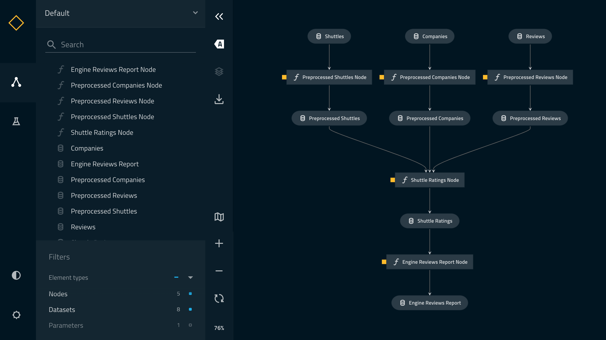

# Kedro Build Tool POC

## Overview

This project is inspired by DBT, build your pipelines with plain SQL and Jinja2 templates.
Reference any input DAG by just using `{{ ref('output_name') }}` or any source from the catalog with `{{ source('source_name') }}` inside the SQL template.



## Example
The file `src/kbt/sql/preprocessed_companies.sql`
```sql
SELECT * FROM {{ source('companies') }}
```

This will create the following node dynamically:
```python
node(
    name='preprocessed_companies_node',
    func=run_sql,
    inputs=['companies', 'parameters'],
    outputs='preprocessed_companies',
)
```

You can also use kedro parameters that you define in the following way:
```sql
SELECT * FROM {{ source('companies') }} WHERE total_fleet_count > {{ param('min_fleet_count') }}
``` 

Check out the [SQL templates](src/kbt/sql/)
Check out the [dynamic pipeline bulding code](src/kbt/pipelines/data_processing/pipeline.py)

## Visualize the pipeline
Try using `kedro viz` to visualize the generated pipeline.

## Mix python nodes with SQL nodes:
Go to the `src/kbt/pipelines/data_processing/pipeline.py` and modify it like this:
```python
    return pipeline(
        [
            node(
                func=preprocess_companies,
                inputs="companies",
                outputs="preprocessed_companies",
                name="preprocess_companies_node",
            ),
            node(
                func=preprocess_shuttles,
                inputs="shuttles",
                outputs="preprocessed_shuttles",
                name="preprocess_shuttles_node",
            ),
            *nodes
        ]
    )
```

And delete the following SQL files:
- `src/kbt/sql/preprocessed_companies.sql`
- `src/kbt/sql/preprocessed_shuttles.sql`

Run or visualize the pipeline, it will still work correctly mixing the python and SQL nodes.

## Technical details
This project uses an in memory DuckDB under the hood, which is faster and more memory efficient than pandas, and can query DataFrames directly. DuckDB has the same syntax as PostgreSQL.

We created `source`, `ref`, and `param` as closure functions that are part of the Jinja2 template context and get information about the inputs and parameters that we can later use to build the pipeline DAG dynamically.
